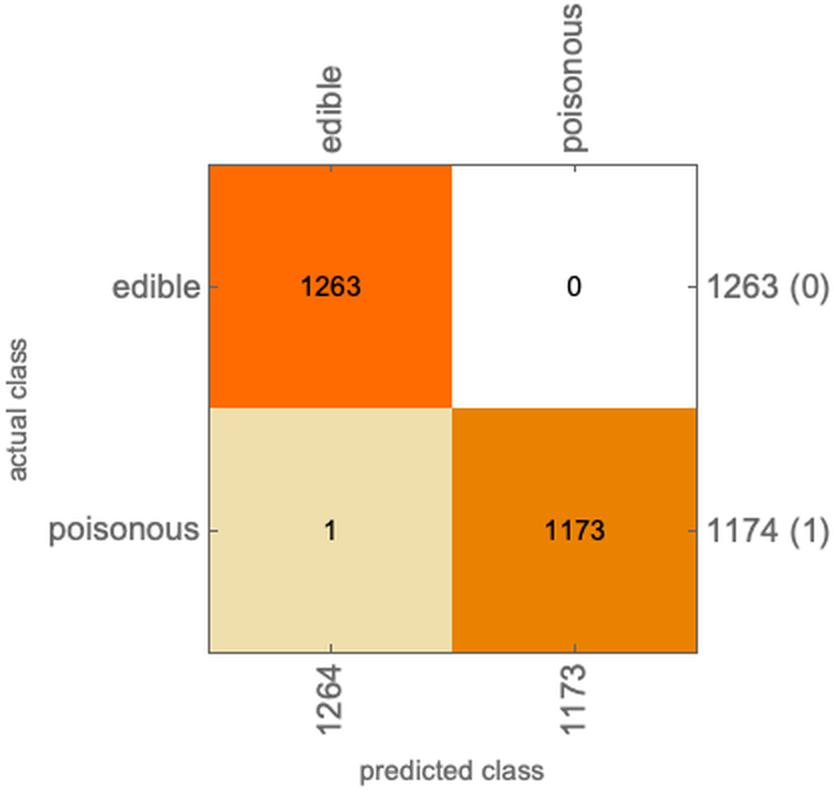
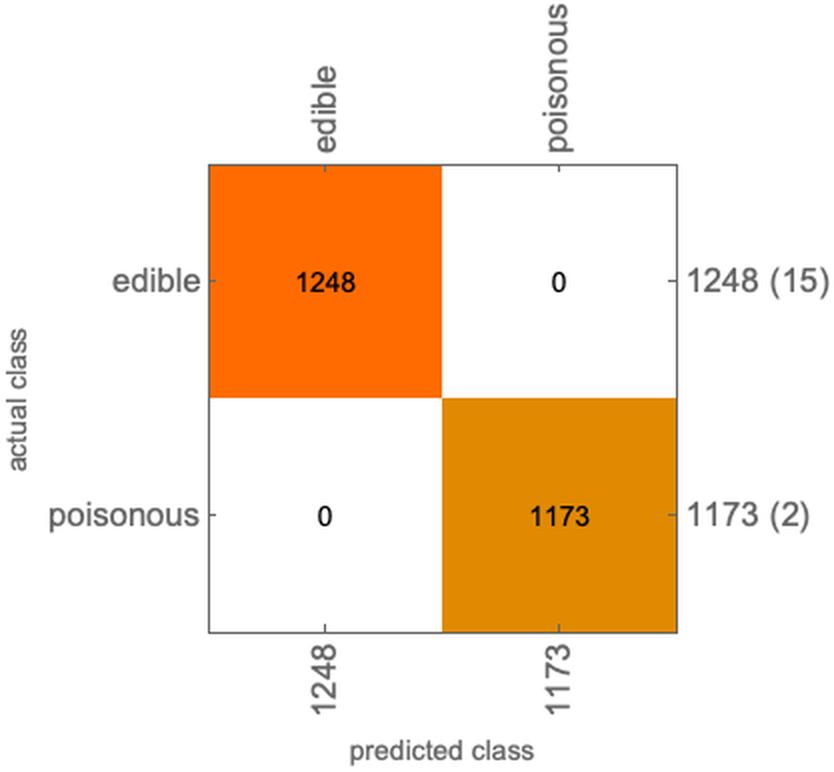
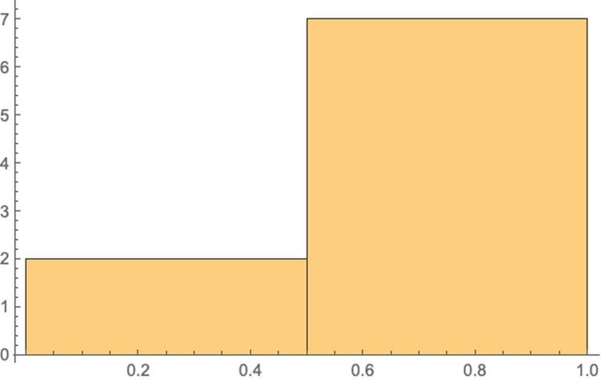

# 卖蘑菇吃死人怎么办
---

模型的效用函数实战_毒蘑菇

# Background
---

我是卖蘑菇的，我每天去山里采蘑菇，我要一个二分类模型来判断蘑菇是有毒的还是没毒的。

我们都知道分类，弄出一个模型后，还要看模型的准确率是否高，有时虽然模型准确率98%了，但是那2%的不准确中的结果可能会出事，所以模型的落地这里会有一系列的规则。

### 效用函数utilityFunction

在Mathematica中，模型可以添加一个utilityFunction，可以直接作用在模型上使用的。
有几个功能，一个是比如按概率值去选择分类结果，一个是误判别的加惩罚。

目的有两个
1@这个有什么意义。
2@这个具体是怎么作用的，原理是什么。

# 应用场景
---

模型是固定的，分类一个毒蘑还是可以吃的蘑菇，业务和模型的落地是多变的。

###### 场景1

我是一个卖蘑菇的，我每次在山上摘了许多蘑菇，我要一个模型给我挑出来没毒的蘑菇拿去卖掉，其他的扔掉。

###### 场景2

我是买蘑菇的，我要一个模型给我挑出来有毒的蘑菇去毒死人。

。。。

# Let's begin
---

Load the training set and test set of the "Mushroom" dataset:

    trainingset = ExampleData[{"MachineLearning", "Mushroom"}, "TrainingData"];
    

    testset = ExampleData[{"MachineLearning", "Mushroom"}, "TestData"];
    

Train a classifier on a part of the training set:

    SeedRandom[1234];
    trainingSample = RandomSample[trainingset, 500];
    

    c = Classify[trainingset, Method -> "NearestNeighbors"]

    trainingSample // Length

500

Visualize the confusion matrix of the classifier on the test set:

    ClassifierMeasurements[c, testset, "ConfusionMatrixPlot"]

    ClassifierMeasurements[c, testset, "Accuracy"]

0.99918

在这个例子中，有大量有毒的蘑菇被判别为可吃的，这个问题就大了，会出人命的，这个模型不可用啊。
模型的概率阈值调大，就是召回的少了，准确率高了。

    utility = <|"edible" -> <|"edible" -> 1, "poisonous" -> 0, Indeterminate -> 0.5|>,"poisonous" -> <|"edible" -> 0, "poisonous" -> 1, Indeterminate -> 0.5|>|>;
    

    utility = <|"edible" -> <|"edible" -> 1, "poisonous" -> 0, Indeterminate -> 0.5|>,"poisonous" -> <|"edible" -> 0, "poisonous" -> 1, Indeterminate -> 0.8|>|>;
    

    ClassifierMeasurements[c, testset, "ConfusionMatrixPlot",  UtilityFunction -> utility]

    ClassifierMeasurements[c, testset, "Accuracy",  UtilityFunction -> utility]

0.99959

比如上面的例子中，漏判了A个毒蘑菇，B个可吃的蘑菇。那我们检测出来的蘑菇，吃会吃死C个人，至少比吃死D个人要好吧。

# 惩罚
---

固定模型0.9的阈值，如果有毒的判别为无毒的，则加大惩罚因子，0变成-10

### 调太大了，可吃的蘑菇太少，蘑菇卖不出去了，宁愿吃死几个人

    utility = <|"edible" -> <|"edible" -> 1, "poisonous" -> 0, Indeterminate -> 0.5|>,"poisonous" -> <|"edible" -> -10, "poisonous" -> 1, Indeterminate -> 0.8|>|>;
    

    ClassifierMeasurements[c, testset, "ConfusionMatrixPlot",  UtilityFunction -> utility]

    ClassifierMeasurements[c, testset, "Accuracy",  UtilityFunction -> utility]

1.

### 调太大了，模型不可用。

    utility = <|"edible" -> <|"edible" -> 1, "poisonous" -> 0, Indeterminate -> 0.5|>,"poisonous" -> <|"edible" -> -1000, "poisonous" -> 1, Indeterminate -> 0.9|>|>;
    ClassifierMeasurements[c, testset, "ConfusionMatrixPlot",  UtilityFunction -> utility]

    ClassifierMeasurements[c, testset, "Accuracy",  UtilityFunction -> utility]

1.

# 调参
---

### 调参的意义

效用矩阵怎么调？在分类模型中，即上面的utility。
在某个这个惩罚强度下，可吃的蘑菇占了，就是我是一个卖蘑菇的，为了少吃死人，那么我每次要损失多少蘑菇比较合适呢？

有了概率值和惩罚值，模型的评估就有拒绝率出现啦，

    utility = <|"edible" -> <|"edible" -> 1, "poisonous" -> 0, Indeterminate -> 0.5|>,"poisonous" -> <|"edible" -> -10, "poisonous" -> 1, Indeterminate -> 0.9|>|>;
    

    有毒测试样本 = Select[testset, #[[2]] == "poisonous" &][[All, 1]];
    

    有毒测试样本 // Length

1175

    p = c[#, "Probabilities"] &;
    

    probs1 = #@"poisonous" & /@ (probs = c[有毒测试样本[[1 ;; -1]], "Probabilities", UtilityFunction -> utility]);
    

    probs2 = #@"poisonous" & /@ (p /@ 有毒测试样本[[1 ;; -1]]);
    

    Union[Chop[#, 10^-5] &[probs1 - probs2]]

{0}

    (*Histogram[Select[probsPois,#<0.9&],PlotRange\[Rule]All]*)

    Select[probs1, # < 0.9 &] // Length

9

    Select[probs1, # < 0.9 &] // Histogram

域值设为0.9问题不大，0.8也没问题，因为中间没多少值

    Select[probs1, 0.9 <= # < 1 &] // Length

1166

###### 注意召回是把拒绝的排除在外的

    recall = ClassifierMeasurements[c, testset, "Recall", UtilityFunction -> utility]

<|edible->1.,poisonous->1.|>

    rejectionRate =  ClassifierMeasurements[c, testset, "RejectionRate", UtilityFunction -> utility]

0.00779327

    classRejectionRate =  ClassifierMeasurements[c, testset, "ClassRejectionRate", UtilityFunction -> utility]

<|edible->0.0118765,poisonous->0.00340426|>

    ClassifierMeasurements[c, testset, "ConfusionMatrixPlot",  UtilityFunction -> utility]

    testset // Length

2438

# Summary
---

模型不太稳定，并且性态会完全不同，因此，文中的一些数字在复现的时候总是会变。

本来是写上篇文章时，遇到效用函数的选项了，研究了一下，被打叉了。。。
然后遇到Classifier的树模型的一个问题，又被打叉了。。。
吐槽：mathematica的写作和问题研究就是中间经常会被一个函数或某些点打叉。。。有些东西看着简单，其实研究曲线和学习曲线还是略陡峭。。。

Mathematica封装了一些选项、方法和细节，有一些功能是他们帮你做好的，可以辅助我们快速去试验，比如各种指标，有的得研究一下，才能去正确使用，比如召回率是把拒绝的排除了，如果涉及到效用函数的话。

    << "/Users/hypergroups/Nutstore/Wolfram \Mathematica/DeployProjects/MyMarkDown/MyMarkDown.wl"

    Notebook2Markdown[EvaluationNotebook[],  "dirOutput" -> NotebookDirectory[],  "title" -> "utility_in_action_mushroom",  ImagePrefix -> "https://raw.githubusercontent.com/HyperGroups/Mathematica/master/\YuQue/mathematica/MachineLearningInAction/mushroom"]