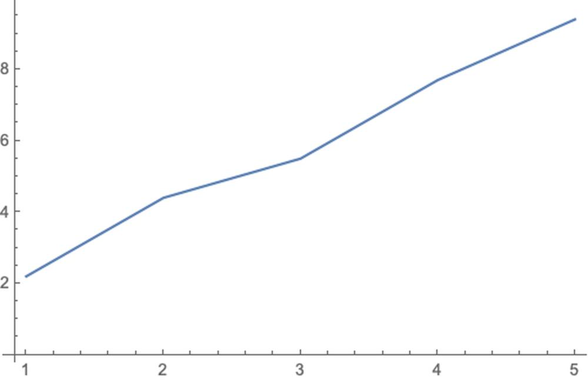
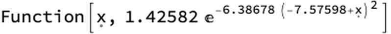
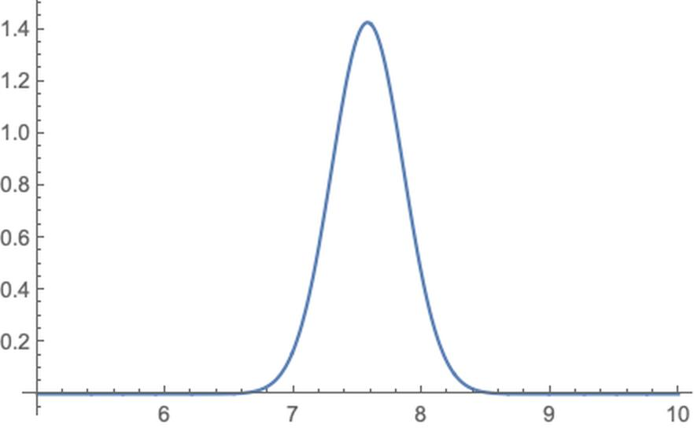
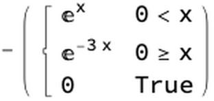
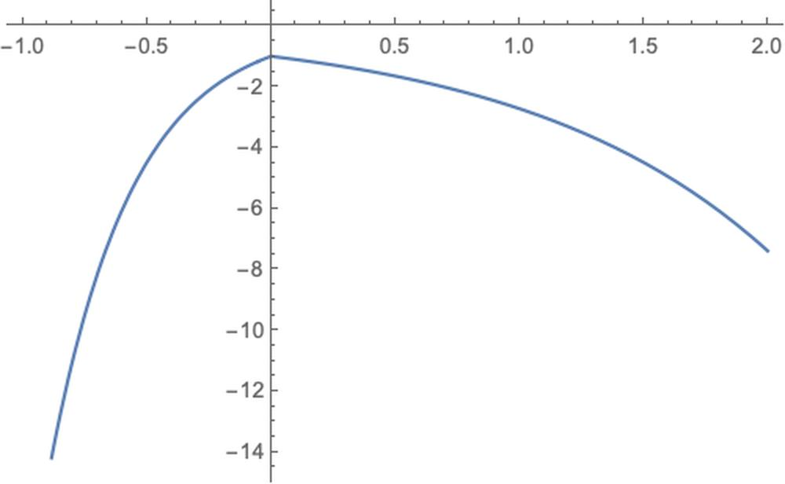

# 效用函数
---

# 效用函数
---

[wikipedia](https://en.wikipedia.org/wiki/Utility#Functions)

Although preferences are the conventional foundation of microeconomics, it is often convenient to represent preferences with a utility function and analyze human behavior indirectly with utility functions. Let X be the consumption set, the set of all mutually-exclusive baskets the consumer could conceivably consume. The consumer's utility function {\displaystyle u\colon X\to \mathbb {R} }  u\colon X\to \R ranks each package in the consumption set. If the consumer strictly prefers x to y or is indifferent between them, then {\displaystyle u(x)\geq u(y)} u(x)\geq u(y).

For example, suppose a consumer's consumption set is X = {nothing, 1 apple,1 orange, 1 apple and 1 orange, 2 apples, 2 oranges}, and its utility function is u(nothing) = 0, u(1 apple) = 1, u(1 orange) = 2, u(1 apple and 1 orange) = 4, u(2 apples) = 2 and u(2 oranges) = 3. Then this consumer prefers 1 orange to 1 apple, but prefers one of each to 2 oranges.

A utility function {\displaystyle u\colon X\to \mathbb {R} }  u\colon X\to \R represents a preference relation {\displaystyle \preceq } \preceq  on X iff for every {\displaystyle x,y\in X} x, y \in X, {\displaystyle u(x)\leq u(y)} u(x)\leq u(y) implies {\displaystyle x\preceq y} x\preceq  y. If u represents {\displaystyle \preceq } \preceq , then this implies {\displaystyle \preceq } \preceq  is complete and transitive, and hence rational.

一个效用函数，如果u(x)>u(y)==>x>y

### 例题

...

# 边际效用递减
---

边际效用递减，是指在一定时间内，在其他商品的消费数量保持不变的条件下，当一个人连续消费某种物品时，随着所消费的该物品的数量增加，其总效用 （total utility） 虽然相应增加，但物品的边际效用 （marginal utility，即每消费一个单位的该物品，其所带来的效用的增加量） 有递减的趋势。

[baike](https://baike.baidu.com/item/%E8%BE%B9%E9%99%85%E6%95%88%E7%94%A8%E9%80%92%E5%87%8F)

在机器学习中，我们在调参数时，某个参数调大，如果带来的正向作用，不如负向作用大时，就没必要使劲调节了。比如正向作用是准确率，负向作用是拒绝率。

在工作过程中，有些高大上的工作就是花精力，但是产出没那么快，也可能没什么产出，产出的价值也没那么多的，作为老板其实蛮关心这方面的东西。

# 应用
---

在推荐系统中，还可以做基于效用的推荐，给每个用户弄一个效用函数。

在机器学习模型落地时，在不修改模型，可以修改模型产出的一些结果，让模型更加可用。
即可以理解为模型的校正，也可以理解为模型的部分落地规则。模型的校正公式可以经验生成，可以用参数估计或数据拟合来生成。

# UtilityFunction@Mathematica Machine Learning
---

    trainingset = {1 -> 2.2, 2 -> 4.4, 3 -> 5.5, 4 -> 7.7, 5 -> 9.4};
    

    ListPlot[list = List @@@ trainingset, Joined -> True]

    p = Predict[trainingset]

Visualize the probability density for a given example:

    example = 4;
    pdf = PDF[p[example, "Distribution"]]

    Plot[pdf[x], {x, 5, 10}, PlotRange -> All]

    utility[a_, p_] := -Piecewise[{{Exp[p - a], a < p}, {Exp[2*(a - p)], a >= p}}]

Use this utility to predict the example:

    f = utility[0, x]

    Plot[f, {x, -1, 2}]

效用函数：假如用户对于修正值的偏好是100%，

    v1 = p@4

4.90545

    v2 = p[4, UtilityFunction -> utility]

5.447

预测的分布是不变的，但是经过效用函数，把预测结果改成了5.447，那么问题来了，这个东西是怎么计算出来的？用了哪些数据？

    utility[v1, v2]

-1.71865

    v1a = p[0]

0.861404

    v1b = p[0, UtilityFunction -> utility]

1.40295

    utility[v1a, v1b]

-1.71865

    Table[utility[v1, v2 + i], {i, -3, 3}]

{-1596.19,-79.4698,-3.95657,-1.71865,-4.67178,-12.6992,-34.5201}

所以效用函数的求解时可能用了优化算法或解方法操作@mathematica，参考另一篇Title为UtilityFunction的，跟mathematica有关丢在那一篇里，这一篇讲通用一点的效用函数，这里就不展开了。

    << "/Users/hypergroups/Nutstore/Wolfram \Mathematica/DeployProjects/MyMarkDown/MyMarkDown.wl"

    Notebook2Markdown[EvaluationNotebook[],  "dirOutput" -> NotebookDirectory[],  "title" -> "functions_about_utility",  ImagePrefix -> "https://raw.githubusercontent.com/HyperGroups/Mathematica/master/\YuQue/mathematica/MachineLearningInAction/utility_function"]