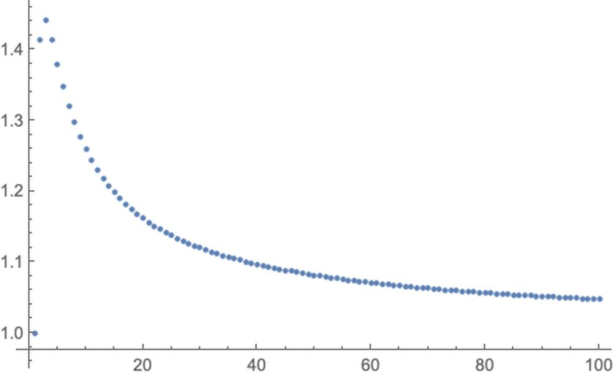
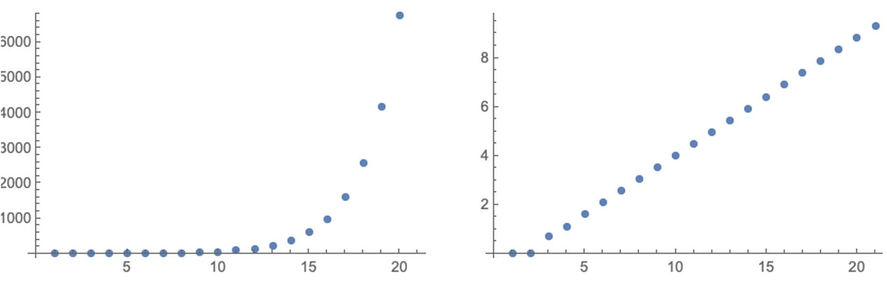
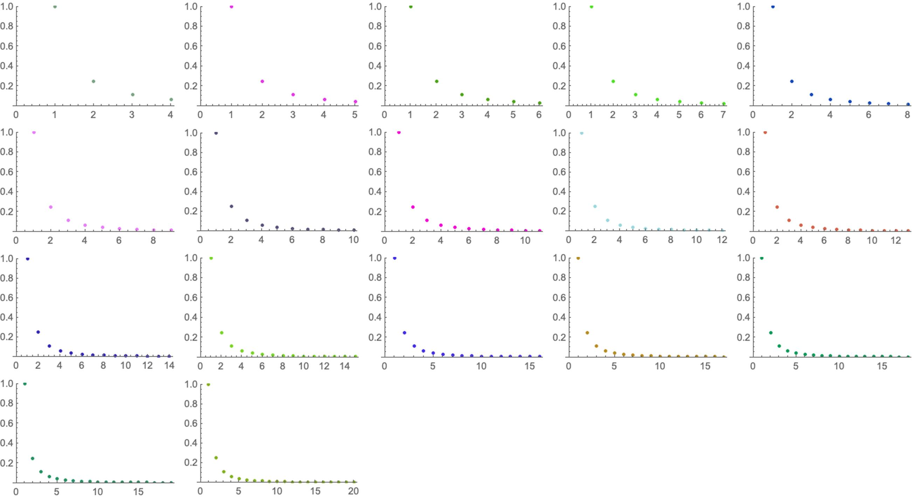

# 数学实验-极限
---

# 实验1
---

观察数列$\sqrt[n]{n}$的前$100$项变化趋势

    t = N[Table[n^(1/n), {n, 1, 100}]];
     ListPlot[t,  PlotStyle -> PointSize[.0095]]

    m = 2;
     xn = 0;
     n = i;
    For[i = 1, i <= 1000, i += 50, If[Abs[xn - 1] > 10^-m, xn = N[n^(1/n), 20];
    Print["i = " i, " ", xn]]];
    

i =  1.0069257256035968317

设此数列收敛于$A=1+u(u\geq 0)$, 不妨取 $u=10^{-2}$, 考察 $\sqrt[n]{n}$与$A$的接近程度。

    u = 10^(-2);
     A = 1 + u;
     m = 5;
     n = 3;
     an = Sqrt[3];
    While[Abs[A - an] >= 10^(-m), n++;
     an = N[n^(1/n)]];
    Print["n= ", n, "an= ", an, "|A-an|= ", Abs[A - an]]

   n= 651   an= 1.01    |A-an|= 1.30983*10^-6

# 实验2 Fibnoacci
---

递推关系，$F_0=1$, $F_1=1$, $F_n=F_n-1+F_n-2$, 令$R_n=\frac{\text{ Fn}}{F_{n+1}}$

    fn1 = 1;
     fn2 = 1;
     rn1 = 1;
    For[i = 3, i <= 14, i++, fn = fn2 + fn1;
     fn2 = fn1;
     fn1 = fn;
      rn = N[fn2/fn1, 20];
     dn = rn - rn1;
     rn1 = rn;
     Print[i, "", fn1, "", rn, "", dn]]

3    2     0.50000000000000000000      -0.50000000000000000000

4    3     0.66666666666666666667      0.1666666666666666667

5    5     0.60000000000000000000      -0.0666666666666666667

6    8     0.62500000000000000000      0.0250000000000000000

7    13     0.61538461538461538462      -0.0096153846153846154

8    21     0.61904761904761904762      0.0036630036630036630

9    34     0.61764705882352941176      -0.0014005602240896359

10    55     0.61818181818181818182      0.0005347593582887701

11    89     0.61797752808988764045      -0.0002042900919305414

12    144     0.61805555555555555556      0.0000780274656679151

13    233     0.61802575107296137339      -0.0000298044825941822

14    377     0.61803713527851458886      0.0000113842055532155

    Clear[f];
     f[n_] := f[n - 1] + f[n - 2];
     f[0] = 1;
     f[1] = 1;
    fab20 = Table[f[i], {i, 0, 20}];
    GraphicsRow@{ListPlot[fab20, PlotStyle -> PointSize[.02]],lnfab20 = Log[fab20];
     ListPlot[lnfab20, PlotStyle -> PointSize[.02]]}

# 实验3
---

利用动画观察当$n\to \infty$时数列$a_n=\frac{1}{n^2}$的变化趋势。

    Clear[tt];
     tt = {1, 1/2^2, 1/3^2};
     p = {};
     Do[ tt = Append[tt, N[1/i^2]];
      AppendTo[p, ListPlot[tt, PlotRange -> {0, 1}, PlotStyle -> {PointSize[.021], RGBColor @@ RandomReal[{0, 1}, {3}]}]], {i, 4, 20}]

    Grid@Partition[p, 5, 5, 1, ""]

# 实验4
---

设数列$\left\{x_n\right\}$与$\left\{y_n\right\}$由下式确定，观察它们的极限是否存在

$$\left\{
\begin{array}{cc}
 x_1=1,y_1=2 & \square  \\
 \sqrt{x_ny_n} & ,n=1,2,\cdots  \\
 y_{n+1}=x_n+y_n & \square  \\
\end{array}
\right.\tag{1}$$

    Clear[f, g];
     f[x_, y_] := Sqrt[x*y];
     g[x_, y_] := (x + y)/2;
     xn = 1;
     yn = 2;
    For[n = 2, n <= 100, n++, xN = xn;
     yN = yn;
     xn = N[f[xN, yN]];
     yn = N[g[xN, yN]];
    ];
    Print["x100= ", xn, "y100= ", yn]

x100= 1.45679    y100= 1.45679

已知数列$\left\{x_n\right\}$, 由$a_n=\frac{\left(x_1+x_2 + \cdots  +x_{101}\right)}{n}(n=1,2,\cdots )$已知数列$x_n$的算术平均.

$$\lim_{n\to \infty } \frac{1}{n}\left(x_1+x_2+\cdots +x_n\right)=\lim_{n\to \infty } x_n\tag{2}$$

只要$a_n$的极限存在，(2)式总是成立，这是Stolz定理的一个特例

### <>StringExpression[CellExpression2PlainText[StyleBox2MD[Cell[Stolz定理, FontWeight -> Bold]]]]<>

对数列 $\left\{x_n\right\}$与$\left\{y_n\right\}$,若 $y_1<y_2<\cdots <y_n<\cdots ,$且 $\lim_{n\to \infty } y_n=+\infty$, 又极限
$\lim_{n\to +\infty } \frac{x_{n+1}-x_n}{y_{n+1}-y_n}=l$(可为$\pm \infty$),则$\lim_{n\to +\infty } \frac{x_0}{y_0}=l$.

# 
---

    Notebook2Markdown[EvaluationNotebook[],  "dirOutput" -> NotebookDirectory[],  "title" -> "Example-Math-Experiment",  ImagePrefix -> "https://raw.githubusercontent.com/HyperGroups/Mathematica/master/\ZhiHu/PlayingMathematica/MathExperiment"]