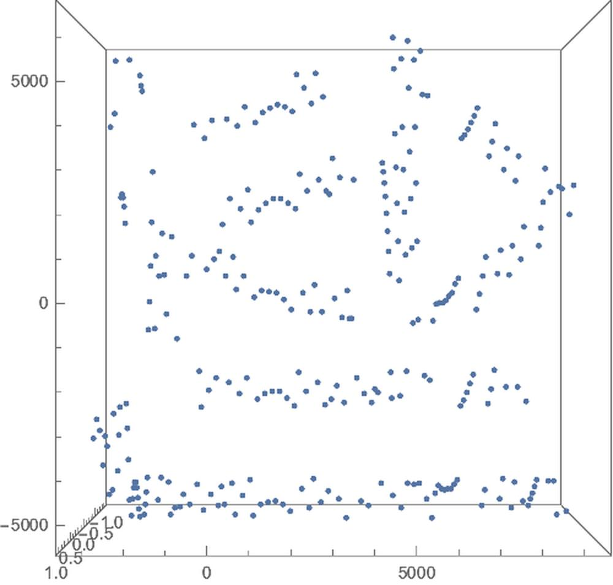
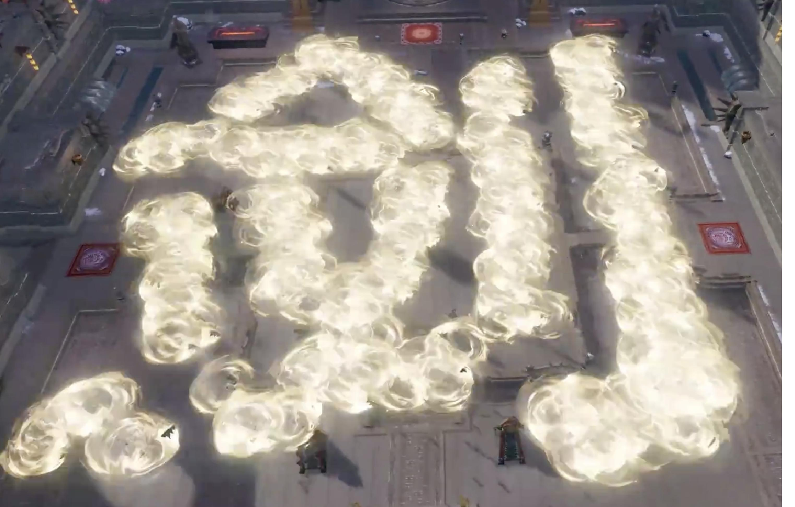

# 用Mathematica 制作3D造型汉字
---

# Background
---

一来简单整理一下，几个Mathematica中相关的函数，大家可以参考一下有空玩玩，二来简单宣传一下几个历史小作品，三来给组织做一些Case展示，有兴趣一起玩的大概能知道玩些啥，怎么玩，然后我只负责挖坑最好。。。

本文主要是专注于汉字的静态三维造型，并且主要是平面上的，其实我们也是可以做到在不同的面上去看，能看不同的汉字，也放了一个Example。

有了基础的汉字的三维坐标后，我们可以控制点出现的先后顺序，就是一种动画的形态了，参考【倾城之恋From风云\[CenterDot]雄霸天下】。

效果主要分两类，一类是传统的艺术字，二类是通过坐标生成的群组的字效果。

# Sample from Internet
---

有空翻拍一下这个大招的片断。

# Sample@剑
---

### 二值化

    pos2D = (Composition[ReflectionTransform[{0, -1}]] /@ (Reverse /@ Position[ImageData[Binarize@Rasterize[Style["剑", 500](*,RasterSize\[Rule]2000*)]], 0]));
    

    ListPlot[pos2D]

### 重采样

如果用来生成群组的效果，采样的点不能太多，得看渲染的引擎支持程度如何，如果是上层的引擎，资源的占用就会过高，所以采样的优化有兴趣的可以玩一下，就是用最少的点群表达一个汉字。

    ListPlot[pos2DCenter = TranslationTransform[{0, 100} - Mean[pos2D] // N]@# & /@ pos2D[[1 ;; -1 ;; 250]]]

### 旋转校正

    pos3D = RotationMatrix[-90 Degree, {0, 0, 1}].{28 #[[1]], 28 #[[2]], 0} & /@ pos2DCenter;
    len = pos3D // LengthListPointPlot3D[pos3D, ViewPoint -> Top]

296

上面这个效果的话，可能看不出来是一个字了，但是如果每一个点有特效能放大的话，效果就明显了，这里得调一调，文末有视频效果链接。

# Raster3D
---

    Graphics3D[{Raster3D[t = {Rasterize[ExpressionCell[Style["Hello", 80, Red], "Output", Background -> None], "Data", Background -> None]}, {{0, 1, 0.4}, {1, 0, 0.6}}, Method -> {"InterpolateValues" -> True}]},  PlotRange -> {0, 1}, ViewPoint -> {-1.54, 0.35, 3},  ViewVertical -> {-0.23, 0.86, 0.46}]

# ImageMesh
---

Create 3D-printable objects from 2D images:

    ImageMesh[ColorNegate[i]]

    RegionProduct[%, Line[{{0.}, {50.}}]]

# Sample@Wall
---

Demonstrations里竟然搜索不到了，我上传了一下

这里[下载](https://github.com/HyperGroups/Mathematica/blob/master/ZhiHu/PlayingMathematica/%E6%B1%89%E5%AD%97%E9%80%A0%E5%9E%8B/bricks.nb)

# Sample@汉字的透视图重构
---

之前的一个重构的问题，本来是想合并到这里的，但是想着这篇主要是整体，就不过于展开细节，并且专注于静态的三维点为主就不放了。

讲的是在多个投影面上，可以看到不同的汉字。

[article](https://zhuanlan.zhihu.com/p/68269562)

# Other&&Summary
---

其他风格化的汉字

关于这个Topic有哪些Example，欢迎链接到评论区或发我~~~

Mathematica里有许多有趣的Demo，但是他们视觉效果太Naive，我们可以从中获取许多数据，然后生成一些更好看更好玩的作品。
当然对Demonstration感兴趣的也可以自己做一些上传。

[projects_page](https://www.yuque.com/animation_projects)

### GIF Gallery

B站作品\[LongDash]\[LongDash]圈重点，多多关注多多支持~~~

[作品_B站](https://www.bilibili.com/video/av56828439/)

    << "/Users/hypergroups/Nutstore/Wolfram \Mathematica/DeployProjects/MyMarkDown/MyMarkDown.wl"

    Notebook2Markdown[EvaluationNotebook[],  "dirOutput" -> NotebookDirectory[], "title" -> "ArtOfWord",  ImagePrefix -> "https://raw.githubusercontent.com/HyperGroups/Mathematica/master/\ZhiHu/PlayingMathematica/汉字造型/"]