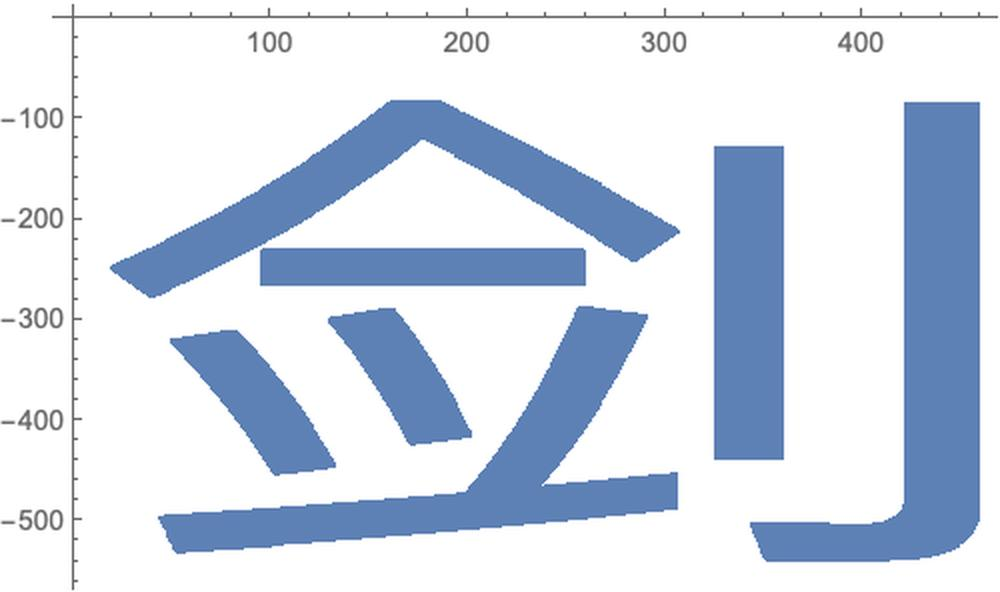
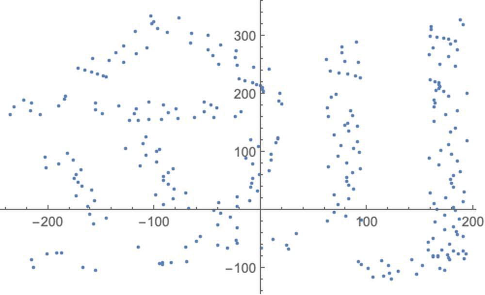
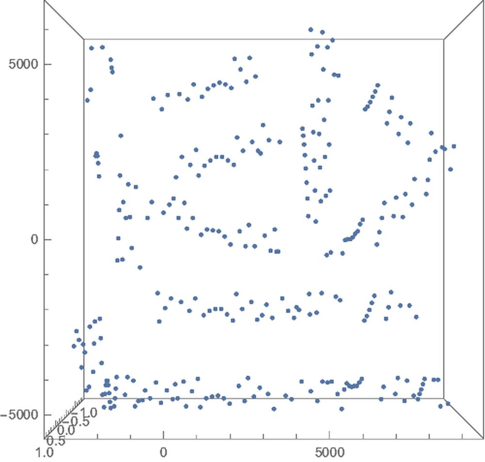
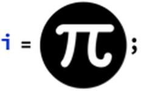
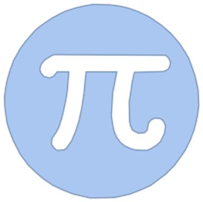
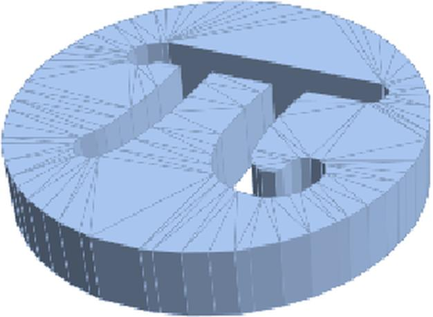

# 汉字的3D造型艺术
---

# Background
---

一来简单整理一下，几个Mathematica中相关的函数，大家可以参考一下有空玩玩，二来简单宣传一下几个历史小作品，三来给组织做一些Case展示，有兴趣一起玩的大概能知道玩些啥，怎么玩，然后我只负责挖坑最好。。。

本文主要是专注于汉字的静态三维造型，并且主要是平面上的。

有了基础的所有汉字的坐标后，那么我们可以控制点出现的先后顺序，又是另一种动画的形态了，参考倾城之恋。

# Sample@Net
---

# Sample@剑
---

    pos2D = (Composition[ReflectionTransform[{0, -1}]] /@ (Reverse /@ Position[ImageData[Binarize@Rasterize[Style["剑", 500](*,RasterSize\[Rule]2000*)]], 0]));
    

    ListPlot[pos2D]

    ListPlot[pos2DCenter = TranslationTransform[{0, 100} - Mean[pos2D] // N]@# & /@ pos2D[[1 ;; -1 ;; 250]]]

    pos3D = RotationMatrix[-90 Degree, {0, 0, 1}].{28 #[[1]], 28 #[[2]], 0} & /@ pos2DCenter;
    len = pos3D // LengthListPointPlot3D[pos3D, ViewPoint -> Top]

296

# Raster3D
---

    Graphics3D[{Raster3D[t = {Rasterize[ExpressionCell[Style["Hello", 80, Red], "Output", Background -> None], "Data", Background -> None]}, {{0, 1, 0.4}, {1, 0, 0.6}}, Method -> {"InterpolateValues" -> True}]},  PlotRange -> {0, 1}, ViewPoint -> {-1.54, 0.35, 3},  ViewVertical -> {-0.23, 0.86, 0.46}]

    \!\(\*Graphics3DBox[Raster3DBox[CompressedData["1:eJztnTuO4zgQhj3A5s4mXGCTTieduPNOFljA8QATb+Aj9CH6Hj7Z3qBGhDhYms12SypSVWV/H8DAL9ZvqopvSn/9+PfvH38cDocvU/pnSv9NKb0GAAAAAAAAAAAAAAAAAAAAAAAAAAAAAAAAAIDYyOHwMiXZkqy1J6LrB9Cw1fe9+H90/QAaJid+juz/0fVHY0N/58VD3jAT3f+j67dmZD1JHTye6GUXXb81tL+xie7/0fV7Y4/y5Jr1I3pZRtfvDeI3FtHLMrp+bxC/sYheltH1e4P4jUX0soyu3xvEbyyil2V0/d4gfmMRvSyj6/cG8RuL6GUZXb83iN9YRC/L6Pq9ce/xOxn8JvO+kvOULqWW/Dq9f0rf21vbFqL7f0T92YdOHn3oHuN3MvJnLs/V+zmn9DP9fg+dW4jo/yVR9Gcf+undh+4tfhVx++4ajNa6hSj+/xHe9U+ivub2tIcPpXy+DtZ7F/Gb68u6b5PSm8z95/T5sfrNMb//kr9X//birS327v+f4Vm/fHwW8jV/dsuHnvP3Wr9/Hqg5fPzKPD5p1X2rYi9fh1bd62Zs7Nn/l+BVv7T7yqc6Xhfkc5T2OZ4h/bno8duI3dRmflfm+b3RlruIYa/+vxSP+hvt5nlt3DbyPDbagtdemgs7YeM3t5d17HYZb8g8DrqMyFupy53/r8Gb/kaMdT3T2miLz53zjxy/Q+OrEcNvPfPfqMmV/6/Fk/5GbA3pYzX6iN3qiKjxK+/nmYe0jTmGd5mLWKjHjf9vwYv+Rt9t6HWVeUxW2usyLxoxfhtlrxrvLrBXzkteRtpaoMWF/2/Fi365Xm/YZa1QrufIuvTlqjgYnjppLtveXfq01fU2a4O9+P9WPOiv+rO71sdyPR5T99eDxu/wMUvDZnnNzcbBHvxfgwf9cj3fvGtdXPXl1PPR0eLXUd1pMhftwf81WOuXeV3HWkMZE9p1quH/pXP8ln3nUw99K2yX85VDx9w3NBC/OvvlPJLJHtnKh7V7FaLFb7le99RD3wrbT1Z1R6GB+NXZL+eQTPbkVH1IVR0SMH6tr/9v+13X4TfYJ3632S/HviZ72+V6/UQ1Bo4cv8bJZB3J2v+1WOu3tt9bB/G7PfUoG83/t7CvxVq/tf3eOohf4ndPrPVb2++tI2D8vnkofyu8+N9WrPVb2++tI2D8lvPPrs7W74EX/9uKtX5h/srUhlyvwZqeJbDA2v+1WOsX1o9Mbcj1Gmz389DesfZ/Ldb6xcf+jbIOeaj9G3V+otx/Fg1r/9dirV+q86BGGkr/Ve3DDRq/ZnsorbH2PS0e9Mudnl/ooW8PG/L+/O/DtMEe/F+DB/3V+POyp//IwPODPfTtZaMaQ5jsZbTAg/9r8KJfrs9z7+I/Mvj8fo/89rIh8zmwsi57iLloL/6/FS/6G3240ffPqe8t/bD3zynyre8LNnw9QP5fvzKpL7z4/1Y86RfuX2duQ97fx25IXMk8b/lq7X/W9rV40y/cP9bcRiOG1fffLvI+NvI3m/f25v9r8ai/rpd7+I9w//a1NuoYS2Pj563XIfd5PnqOldmalUf/X4NX/dL3+Smt+l67z6r1TJYlaXF/Yg8bn9j/Ju1nmJ3lg+dP5d+l95/k9jOoUkpzlup7fijKqVdSlXd0/Tf+l9vnl2nKy5ONBRpa/RZtStel29yGse+ry9tae09/afw3l88PlY/rls/S4rpjDxsrtGiev5zS7+eOdr/PpKKceiVVeUfXv/A/hnh+9yMgc984xeJZ2s/5fc2fpe+kPvjD7OeC28jcn0s+cco+Uo/PLvn99LmLZ1QCAAAAAAAAAAAAAAAAAAAAAAAAAAAAAAAAAAAAAAAAAAAAAAAAAMDj8AvhT44o"], {{0, 1, 0.4}, {1, 0, 0.6}},Method->{"InterpolateValues" -> True}],ImageSize->{368.75780309266554`, 366.87227000850726`},ImageSizeRaw->Automatic,PlotRange->{0, 1},ViewPoint->{0.05740335775095652, 0.13326808244462193`, 1.994729172775204},ViewVertical->{0.029594341941124355`, 0.9972816073694295, -0.07029182201899796}]\)

# ImageMesh
---

Create 3D-printable objects from 2D images:

    ImageMesh[ColorNegate[i]]

    RegionProduct[%, Line[{{0.}, {50.}}]]

# Sample@Wall
---

Demonstrations里竟然搜索不到了，我上传了一下

# Sample@汉字的透视图重构
---

之前的一个重构的问题，本来是想合并到这里的，但是想着这篇主要是整体，并且专注于静态的三维点为主就不放了。

[article](https://zhuanlan.zhihu.com/p/68269562)

# Other
---

其他风格化的汉字

关于这个Topic有哪些Example，欢迎链接发我。

# Summary
---

Mathematica里有许多有趣的Demo，但是他们视觉效果太Naive，我们可以从中获取许多数据，然后生成一些更好看更好玩的作品。
当然对Demonstration感兴趣的也可以自己做一些上传。

[projects_page](https://www.yuque.com/animation_projects)

    << "/Users/hypergroups/Nutstore/Wolfram \Mathematica/DeployProjects/MyMarkDown/MyMarkDown.wl"

    Notebook2Markdown[EvaluationNotebook[],  "dirOutput" -> NotebookDirectory[], "title" -> "汉字的造型艺术",  ImagePrefix -> "https://raw.githubusercontent.com/HyperGroups/Mathematica/master/\ZhiHu/PlayingMathematica/ArtOfWord"]